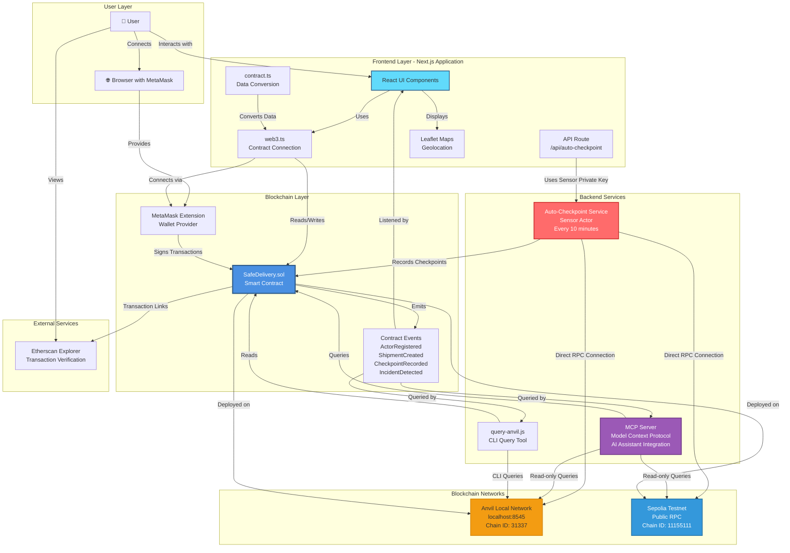

# Safe Delivery - Architecture Diagram

This document provides a comprehensive view of how the different components of the Safe Delivery platform interact with each other.

## System Architecture Overview



## Component Interaction Details

### 1. Frontend Application (React/Next.js)

**Components:**
- **React UI**: User interface built with React 19 and Next.js 16
- **web3.ts**: Handles MetaMask connection, provider setup, and contract instance creation
- **contract.ts**: Provides type-safe contract interactions and data conversion utilities
- **Leaflet Maps**: Interactive maps for geolocation selection and route visualization

**Interactions:**
- Connects to MetaMask via `window.ethereum`
- Creates contract instances using Ethers.js
- Reads contract state (shipments, actors, checkpoints, incidents)
- Writes transactions (register actor, create shipment, record checkpoint)
- Listens to contract events for real-time updates

### 2. Auto-Checkpoint Service

**Location:** `frontend/app/api/auto-checkpoint/route.ts`

**Functionality:**
- Runs as a Next.js API route (can be triggered via cron or manual HTTP request)
- Uses Sensor actor's private key for authentication
- Automatically records checkpoints every 10 minutes for shipments in transit
- Directly connects to blockchain via Ethers.js JsonRpcProvider
- Simulates IoT device behavior

**Interactions:**
- Direct RPC connection to Anvil or Sepolia (NO MetaMask - uses JsonRpcProvider)
- Uses private key authentication (SENSOR_PRIVATE_KEY env var)
- Creates wallet from private key: `new ethers.Wallet(SENSOR_PRIVATE_KEY, provider)`
- Calls `recordCheckpoint()` on the smart contract
- Only processes shipments with status `InTransit` or `OutForDelivery`

### 3. Smart Contract (SafeDelivery.sol)

**Core Functionality:**
- Actor management with approval workflow
- Shipment lifecycle management (6 statuses)
- Checkpoint recording with geolocation
- Automatic incident detection (delays, temperature violations, lost shipments)
- Role-based access control

**Key Functions:**
- `registerActor()`: Register new actors (requires admin approval)
- `setActorApprovalStatus()`: Admin approves/rejects actors
- `createShipment()`: Senders create new shipments
- `recordCheckpoint()`: Actors record checkpoints with location data
- `confirmDelivery()`: Recipients confirm delivery
- `_checkDelayAndLost()`: Internal function for automatic incident detection

**Events Emitted:**
- `ActorRegistered`: When an actor registers
- `ActorApprovalStatusChanged`: When admin changes approval status
- `ShipmentCreated`: When a shipment is created
- `CheckpointRecorded`: When a checkpoint is recorded
- `IncidentDetected`: When an incident is automatically detected

### 4. MCP Server

**Location:** `mcp-server/src/index.ts`

**Functionality:**
- Model Context Protocol server for AI assistant integration
- Provides read-only access to contract data
- Enables AI assistants (like Claude) to query blockchain data directly

**Available Tools:**
- `get_contract_info`: Get contract admin and ID counters
- `get_shipment`: Get shipment details by ID
- `get_all_shipments`: Get all shipments (with limit)
- `get_checkpoint`: Get checkpoint details
- `get_actor`: Get actor information
- `get_incident`: Get incident details
- `get_transaction`: Get transaction details
- `get_contract_events`: Query contract events

**Interactions:**
- Direct RPC connection to Anvil or Sepolia
- Read-only operations (no write transactions)
- Uses contract ABI from `frontend/lib/contract-abi.json`

### 5. Query Script (query-anvil.js)

**Location:** `scripts/query-anvil.js`

**Functionality:**
- CLI tool for querying contract state
- Useful for debugging and manual inspection
- Formats and displays contract data in human-readable format

**Interactions:**
- Direct RPC connection to Anvil (configurable)
- Reads contract state via Ethers.js
- Formats enum values, temperatures, coordinates for display

### 6. Blockchain Networks

**Anvil (Local Development):**
- Default RPC: `http://localhost:8545`
- Chain ID: `31337`
- Used for local development and testing
- Fast block times, no gas costs

**Sepolia (Testnet):**
- Public RPC: `https://rpc.sepolia.org` or Alchemy
- Chain ID: `11155111`
- Used for public testing and demonstration
- Real testnet ETH required for transactions
- Contract deployed at: `0x7803d73C572f1FEa22542f58cE827ef5236cf1cF`

## Data Flow Examples

### Example 1: User Creates a Shipment

```
1. User → React UI: Fills shipment form
2. React UI → web3.ts: Calls getContract()
3. web3.ts → MetaMask: Requests transaction signature
4. MetaMask → User: Shows transaction for approval
5. User → MetaMask: Approves transaction
6. MetaMask → Smart Contract: Sends createShipment() transaction
7. Smart Contract → Blockchain: Transaction mined
8. Smart Contract → Events: Emits ShipmentCreated event
9. Events → React UI: Frontend listens and updates UI
10. Smart Contract → Etherscan: Transaction visible on explorer
```

### Example 2: Auto-Checkpoint Service Records Checkpoint

```
1. Cron/HTTP → API Route: Triggers /api/auto-checkpoint
2. API Route → Ethers.js: Creates provider with RPC URL
3. API Route → Ethers.js: Creates wallet with SENSOR_PRIVATE_KEY
4. API Route → Smart Contract: Queries shipments in transit
5. API Route → Smart Contract: Checks last checkpoint timestamp
6. API Route → Smart Contract: Calls recordCheckpoint() if 10+ minutes passed
7. Smart Contract → Blockchain: Transaction mined
8. Smart Contract → Events: Emits CheckpointRecorded event
9. Events → React UI: Frontend can listen and update map
```

### Example 3: AI Assistant Queries Contract via MCP

```
1. AI Assistant → MCP Server: Requests get_shipment tool
2. MCP Server → Ethers.js: Creates provider with RPC URL
3. MCP Server → Smart Contract: Calls getShipment(shipmentId)
4. Smart Contract → MCP Server: Returns shipment data
5. MCP Server → AI Assistant: Formats and returns JSON response
```

## Technology Stack

| Layer | Technology |
|-------|-----------|
| Frontend Framework | React 19, Next.js 16 |
| Styling | Tailwind CSS 4 |
| Web3 Library | Ethers.js 6.16.0 |
| Maps | Leaflet 1.9.4, React-Leaflet 5.0.0 |
| Smart Contracts | Solidity ^0.8.20 |
| Development Tools | Foundry (Forge, Cast, Anvil) |
| Blockchain Networks | Ethereum Sepolia, Anvil Local |
| Backend Service | Next.js API Routes |
| MCP Server | @modelcontextprotocol/sdk |
| Notifications | React Hot Toast 2.6.0 |

## Security Considerations

1. **Private Key Management**: Auto-checkpoint service uses environment variables for private keys (never committed to git)
2. **Role-Based Access**: Smart contract enforces role-based permissions
3. **Admin Approval**: All actors must be approved by admin before interacting
4. **Transaction Signing**: All write operations require MetaMask signature
5. **Read-Only Access**: MCP server and query script only perform read operations

## Deployment Architecture

```
┌─────────────────────────────────────────────────────────┐
│                    Production Setup                      │
├─────────────────────────────────────────────────────────┤
│                                                          │
│  Frontend (Vercel/Next.js)                             │
│  ├── React UI                                           │
│  ├── API Route (/api/auto-checkpoint)                   │
│  └── Environment Variables:                            │
│      - NEXT_PUBLIC_CONTRACT_ADDRESS                     │
│      - NEXT_PUBLIC_RPC_URL                              │
│      - RPC_URL (for API route)                          │
│      - SENSOR_PRIVATE_KEY (for API route)               │
│                                                          │
│  Smart Contract (Sepolia Testnet)                        │
│  └── Address: 0x7803d73C572f1FEa22542f58cE827ef5236cf1cF│
│                                                          │
│  Cron Service (Vercel Cron / External)                  │
│  └── Calls /api/auto-checkpoint every 10 minutes        │
│                                                          │
└─────────────────────────────────────────────────────────┘
```

## Development vs Production

**Development (Anvil):**
- Local blockchain network
- Fast transactions
- No gas costs
- Contract deployed via Foundry scripts
- Frontend connects to `http://localhost:8545`

**Production (Sepolia):**
- Public testnet
- Real testnet ETH required
- Contract verified on Etherscan
- Frontend connects to public RPC or Alchemy
- Auto-checkpoint service uses same network

